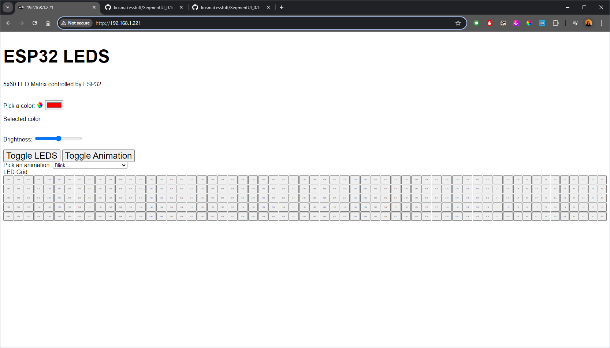

# SegmentUI_0.1

<!-- Provide a general description of the project here -->
A ESP32 board is connected to a 5x60 grid of LEDs, addressable as XY coordinates or single strip. The LEDS are controlled via a network UI served by the ESP32 for animation styles, colors, brightness, and settings. 

This project is likely more useful as a reference for those building similar projects, rather than using it directly. It's a personal side project exploring algorithmic coding with LED lights and serving UI's over the network.

THIS IS A WIP! This is a side project. Some things may not work and will change. 

## Controlling LEDS
<!-- Instructions on how to use the project -->
Current UI

This UI is very simple and has almost no styling. There's some basic color picking, brightness, toggling of animation, toggling of all LEDs, an animation selector and a grid of all the LEDs that lets you turn on individual LEDs. 

To access the UI, you will need to use the IP address that is printed out from your ESP32 serial monitor and paste that into your browser.

If you want to add new animations you need to modify the code to add it. 

## How to Build
<!-- Steps to build the project -->

This project uses a number of libraries. 
<ol>
<li>PlatformIO
<li>VSCode
<li>Arduino.h
<li>FastLED.h
<li>DNSServer.h
<li>WiFi.h
<li>AsyncTCP.h
<li>ESPAsyncWebServer.h
</ol>

## Future Plans
<!-- Outline what is planned for future development -->
In the future, I would like to make this more accessible to different configurations of LEDs instead of being hard-coded to the dimensions that they are now.

I would also like to keep working on the user interface and make it simpler and easy to use,  preferably mobile friendly.

## Notes on Usage and Building
<!-- Additional notes on usage and building -->

